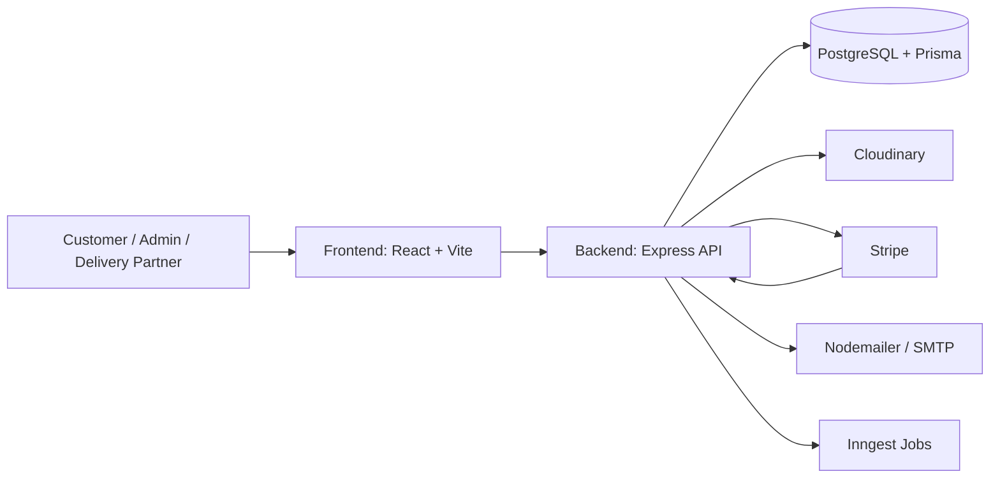

# Grocery Delivery App

**Version:** 1.0.0  
**Author:** Ajitesh Dakua

A full-stack grocery delivery application built with a React + TypeScript + Vite frontend and an Express + Prisma + PostgreSQL backend. The app includes customer shopping, cart and checkout flows, address management, order tracking, delivery partner workflows, and admin panels for managing products and orders.

## Live Demo

- Frontend: https://grocery-delivery-delta-ten.vercel.app/
- Backend API: https://grocery-delivery-server-wine-theta.vercel.app/

## Project Structure

```text
Grocery Delivery App/
  client/   # React frontend
  server/   # Express backend, Prisma, integrations
```

## Architecture



The frontend calls the backend through `VITE_BASE_URL`. The backend reads and writes data through Prisma, then connects to third-party services for media uploads, payments, email notifications, and background tasks.

## Screenshots

### Homepage Hero


The screenshot above shows the landing page hero section with the app branding, navigation, and primary call to action.

### Client

The client app is located in `client/` and uses:

- React 19
- TypeScript
- Vite
- React Router
- Tailwind CSS 4
- Leaflet / React Leaflet for map views
- Axios for API calls
- React Hot Toast for notifications
- Lucide React icons

### Server

The server app is located in `server/` and uses:

- Express 5
- Prisma ORM
- PostgreSQL-compatible database connection via `DATABASE_URL`
- JWT authentication
- Cloudinary for image uploads
- Nodemailer for email notifications
- Stripe for payments and webhook handling
- Inngest for background/event-driven workflows

## API Endpoints

### Auth

- `POST /api/auth/register` - register a user
- `POST /api/auth/login` - log in a user

### Products

- `GET /api/products` - list products
- `GET /api/products/:id` - get one product
- `GET /api/products/flash-deals` - get flash deal products
- `POST /api/products` - create a product, admin only
- `PUT /api/products/:id` - update a product, admin only
- `DELETE /api/products/:id` - delete a product, admin only

### Addresses

- `GET /api/addresses` - list saved addresses
- `POST /api/addresses` - add an address
- `PUT /api/addresses/:id` - update an address
- `DELETE /api/addresses/:id` - delete an address

### Orders

- `POST /api/orders` - create an order
- `GET /api/orders` - get the signed-in user's orders
- `GET /api/orders/:id` - get order details
- `GET /api/orders/:id/location` - get live order location
- `GET /api/orders/all` - get all orders, admin only
- `PUT /api/orders/:id/status` - update order status, admin only

### Admin

- `GET /api/admin/stats` - dashboard statistics
- `GET /api/admin/delivery-partners` - list delivery partners
- `POST /api/admin/delivery-partners` - create a delivery partner
- `PUT /api/admin/delivery-partners/:id` - update a delivery partner
- `PUT /api/admin/order/:id/assign` - assign a delivery partner to an order

### Delivery Partner

- `POST /api/delivery/login` - delivery partner login
- `GET /api/delivery/my-deliveries` - list assigned deliveries
- `GET /api/delivery/my-deliveries/:id` - get delivery details
- `PUT /api/delivery/my-deliveries/:id/complete` - mark delivery complete
- `PUT /api/delivery/my-deliveries/:id/cancel` - cancel delivery
- `PUT /api/delivery/my-deliveries/:id/status` - update delivery status
- `PUT /api/delivery/my-deliveries/:id/location` - update live location

### Upload and Webhooks

- `POST /api/upload` - upload images to Cloudinary
- `POST /api/stripe` - Stripe webhook handler

### Inngest

- `POST /api/inngest` - event processing and background workflows

## User Roles

- Customer - browse products, manage addresses, place orders, and track deliveries
- Admin - manage products, orders, delivery partners, and dashboard stats
- Delivery Partner - view assigned deliveries, update delivery progress, and share live location

## Project Features by Module

### Authentication Module

- User register and login
- Role-based access control
- Protected frontend and backend routes

### Catalog Module

- Product listing and product detail pages
- Flash deals section
- Search and browse experience

### Cart and Checkout Module

- Add and remove cart items
- Checkout review and payment flow
- Address selection and shipping summary

### Orders and Tracking Module

- Order creation and history
- Live location tracking
- OTP and delivery progress flow

### Admin Module

- Admin dashboard and analytics
- Product management
- Order management and assignment
- Delivery partner management

### Delivery Module

- Delivery partner login
- Assigned delivery list
- Status updates, completion, and cancellation

### Integrations Module

- Cloudinary image upload
- Stripe payment and webhook handling
- Nodemailer email delivery
- Inngest background processing

## Main Features

- User authentication and protected routes
- Product browsing and search
- Cart management
- Checkout and payment flow
- Address CRUD and delivery selection
- Order history and live order tracking
- Delivery partner dashboard and OTP flow
- Admin dashboard for products, orders, and delivery partners
- Image upload and cloud storage support

## Important Files and Folders

### Client files

- `client/src/main.tsx` - application entry point
- `client/src/App.tsx` - top-level app routing and layout
- `client/src/config/api.ts` - API client configuration
- `client/src/context/` - auth and cart state management
- `client/src/components/` - reusable UI components
- `client/src/pages/` - application pages and role-based dashboards
- `client/src/types/` - shared TypeScript types

### Server files

- `server/server.ts` - Express server entry point
- `server/prisma/schema.prisma` - database schema
- `server/seed.ts` - seed script
- `server/config/` - Cloudinary, Nodemailer, and Prisma setup
- `server/controllers/` - request handlers
- `server/middleware/` - auth and role protection
- `server/Routes/` - API route definitions
- `server/inngest/` - background event workflows

## Prerequisites

- Node.js 18 or newer
- npm
- A PostgreSQL database or compatible database URL
- Stripe account credentials
- Cloudinary account credentials
- SMTP credentials for transactional email

## Environment Variables

### Client environment

Create a `.env` file inside `client/` and define:

```env
VITE_BASE_URL=http://localhost:3000/api
VITE_CURRENCY_SYMBOL=₹
```

### Server environment

Create a `.env` file inside `server/` and define:

```env
DATABASE_URL=
JWT_SECRET=
CLIENT_URL=http://localhost:5173
ADMIN_EMAILS=
CLOUDINARY_CLOUD_NAME=
CLOUDINARY_API_KEY=
CLOUDINARY_API_SECRET=
SMTP_USER=
SMTP_PASS=
SENDER_EMAIL=
STRIPE_SECRET_KEY=
STRIPE_WEBHOOK_SECRET=
PORT=3000
```

## Install Dependencies

Install dependencies separately for both apps.

### Client

```bash
cd client
npm install
```

### Server

```bash
cd server
npm install
```

> The server `postinstall` script runs `prisma generate` automatically.

## Quick Run Process

Open two terminals.

### Terminal 1 - Start the backend

```bash
cd server
npm run server
```

You can also use:

```bash
cd server
npm start
```

### Terminal 2 - Start the frontend

```bash
cd client
npm run dev
```

The default local URLs are usually:

- Frontend: `http://localhost:5173`
- Backend: `http://localhost:3000`

## Build Process

### Client build

```bash
cd client
npm run build
```

### Server build

```bash
cd server
npm run build
```

## Linting

### Client

```bash
cd client
npm run lint
```

## Database and Seed Process

If you need to prepare sample data, run the seed script from the server folder.

```bash
cd server
npm run seed
```

### Prisma migration commands

Use these commands from the `server/` folder when the Prisma schema changes:

```bash
npx prisma migrate dev --name init
npx prisma migrate deploy
npx prisma migrate reset
npx prisma generate
```

If the Prisma schema changes, make sure the client is regenerated by reinstalling dependencies or running the Prisma generate step used by `postinstall`.

## Notes

- Update `VITE_BASE_URL` if your backend runs on a different host or port.
- Keep `CLIENT_URL` aligned with the frontend URL so email links and redirects work correctly.
- Store all secret values only in environment files and never commit them to source control.

## Future Enhancements

- Add wishlist and saved items support
- Introduce product recommendations based on order history
- Add order scheduling and preferred delivery slots
- Improve analytics dashboards with charts and export options
- Add push notifications for order status updates
- Expand payment options and wallet support

## License

This project is licensed under the MIT License.

Copyright (c) 2026 Ajitesh Dakua

Permission is hereby granted, free of charge, to any person obtaining a copy
of this software and associated documentation files (the "Software"), to deal
in the Software without restriction, including without limitation the rights
to use, copy, modify, merge, publish, distribute, sublicense, and/or sell
copies of the Software, and to permit persons to whom the Software is
furnished to do so, subject to the following conditions:

The above copyright notice and this permission notice shall be included in all
copies or substantial portions of the Software.

THE SOFTWARE IS PROVIDED "AS IS", WITHOUT WARRANTY OF ANY KIND, EXPRESS OR
IMPLIED, INCLUDING BUT NOT LIMITED TO THE WARRANTIES OF MERCHANTABILITY,
FITNESS FOR A PARTICULAR PURPOSE AND NONINFRINGEMENT. IN NO EVENT SHALL THE
AUTHORS OR COPYRIGHT HOLDERS BE LIABLE FOR ANY CLAIM, DAMAGES OR OTHER
LIABILITY, WHETHER IN AN ACTION OF CONTRACT, TORT OR OTHERWISE, ARISING FROM,
OUT OF OR IN CONNECTION WITH THE SOFTWARE OR THE USE OR OTHER DEALINGS IN THE
SOFTWARE.
